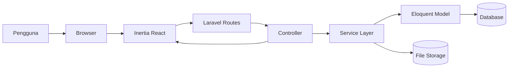
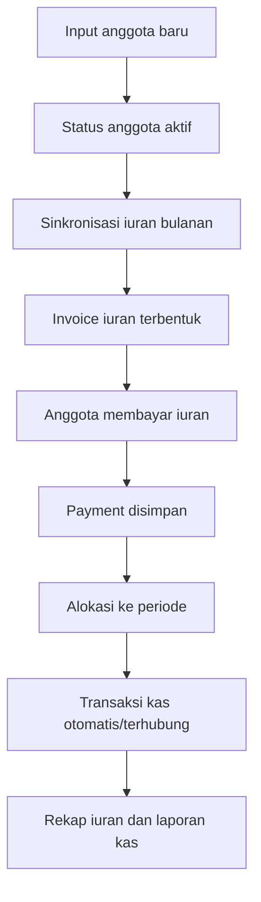
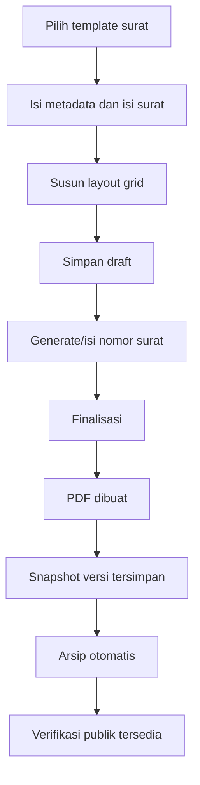
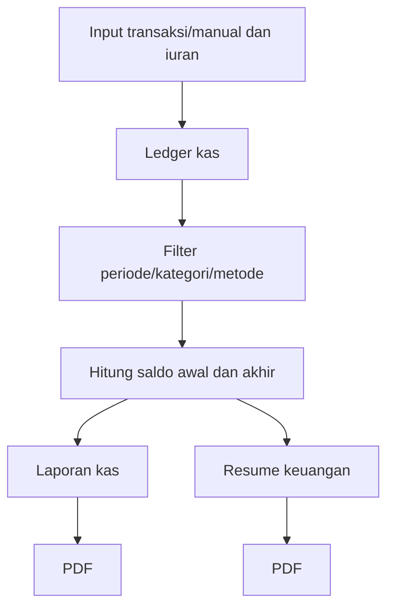

# Dokumentasi Presentasi Open Bidding Aplikasi IDI

Tanggal penyusunan: 19 Juni 2026  
Basis telaah: kode aplikasi pada repository `idi-apps`  
Target audiens: panitia/penilai open bidding, pengurus IDI, tim sekretariat, bendahara, dan pemangku kepentingan operasional cabang

---

## 1. Ringkasan Eksekutif

Aplikasi IDI adalah sistem informasi administrasi organisasi yang dirancang untuk membantu pengurus IDI mengelola proses kerja harian secara terpusat, rapi, dan dapat diaudit. Aplikasi ini mencakup pengelolaan data anggota, iuran, kas/transaksi, laporan keuangan, sekretariat/surat-menyurat, agenda, arsip dokumen, serta pengaturan akses pengguna.

Nilai utama aplikasi ini untuk kebutuhan open bidding adalah:

- Menyatukan data anggota, iuran, kas, surat, dan arsip dalam satu platform.
- Mengurangi pekerjaan manual berbasis spreadsheet dan folder dokumen terpisah.
- Mendukung akuntabilitas melalui role-permission, audit log, soft delete pada tabel inti, dokumen bukti transaksi, dan riwayat versi surat.
- Mempercepat layanan sekretariat melalui template surat, grid builder, penomoran, finalisasi PDF, arsip otomatis, dan verifikasi surat publik.
- Memberikan transparansi keuangan melalui ledger iuran, transaksi kas, rekap, dashboard KPI, dan export PDF/XLSX.

Secara teknologi, aplikasi dibangun menggunakan Laravel 12, Inertia.js, React, Tailwind CSS, Ant Design, Spatie Permission, Spatie Activitylog, DomPDF/Browsershot, QR Code, dan Maatwebsite Excel.

---

## 2. Narasi Pembuka Presentasi

IDI sebagai organisasi profesi membutuhkan sistem administrasi yang mampu menjaga ketertiban data, mempercepat pelayanan anggota, dan memperkuat akuntabilitas pengurus. Dalam operasional harian, pekerjaan sekretariat dan bendahara sering kali tersebar di banyak file: spreadsheet anggota, daftar iuran, bukti transfer, surat keluar, dokumen rapat, dan laporan kas.

Aplikasi IDI ini hadir sebagai platform terpadu untuk menata proses tersebut. Sistem tidak hanya menjadi tempat input data, tetapi juga mendukung alur kerja organisasi: anggota dicatat, iuran dihitung dan direkap, transaksi kas terekam dengan bukti, laporan bisa dicetak, surat dibuat dari template, surat final memiliki versi PDF dan tautan verifikasi, sementara hak akses pengguna dapat diatur sesuai peran.

Fokus presentasi open bidding:

1. Menunjukkan pemahaman terhadap kebutuhan organisasi IDI.
2. Menjelaskan ruang lingkup fitur yang sudah tersedia.
3. Menunjukkan kesiapan teknis aplikasi untuk diimplementasikan dan dikembangkan.
4. Menunjukkan aspek keamanan, auditabilitas, dan keberlanjutan pengembangan.
5. Memberikan alur demo yang mudah dipahami oleh penilai.

---

## 3. Permasalahan Operasional Yang Diselesaikan

### 3.1 Data anggota tersebar dan sulit diperbarui

Tantangan:

- Data anggota disimpan dalam banyak spreadsheet.
- Risiko duplikasi NPA, email, atau data kontak.
- Sulit memfilter status anggota aktif, mutasi, meninggal, atau kategori lain.
- Riwayat import dan konflik data sulit dilacak.

Solusi aplikasi:

- Modul Anggota dengan data NPA, nama, pendidikan, telepon, gender, tempat/tanggal lahir, email, divisi, jabatan, tanggal bergabung, status, SIP, alamat, dan catatan.
- Filter, sorting, pagination, statistik ringkas, dan relasi ke master data.
- Import/Export anggota via XLSX/CSV.
- Mekanisme batch import dan penyelesaian konflik.

### 3.2 Iuran anggota sulit dipantau

Tantangan:

- Pembayaran iuran dapat mencakup beberapa bulan sekaligus.
- Tunggakan sulit dihitung otomatis.
- Rekap pembayaran per anggota dan per periode sering membutuhkan pekerjaan manual.
- Koreksi pembayaran perlu alasan dan jejak.

Solusi aplikasi:

- Ledger iuran berbasis periode.
- Pengaturan nominal iuran, periode mulai, tanggal jatuh tempo, masa tenggang, dan kebijakan pembayaran parsial.
- Pembayaran iuran dapat dialokasikan ke rentang periode tertentu.
- Void dan update pembayaran membutuhkan alasan.
- Rekap iuran dapat difilter dan diekspor XLSX.

### 3.3 Kas dan laporan keuangan perlu transparansi

Tantangan:

- Bukti transaksi sering terpisah dari catatan kas.
- Saldo berjalan sulit dipastikan ketika ada filter periode/kategori/metode.
- Transaksi dari iuran dan transaksi manual perlu dibedakan.
- Laporan perlu bisa dicetak.

Solusi aplikasi:

- Modul transaksi kas masuk/keluar.
- Kategori kas dan metode pembayaran sebagai master data.
- Bukti transaksi tersimpan sebagai dokumen.
- Running balance, opening balance, closing balance, dan saldo per metode.
- Transaksi yang berasal dari iuran dikunci agar tidak diedit manual.
- Laporan kas dan resume keuangan dapat dibuat dan dicetak PDF.

### 3.4 Surat-menyurat dan arsip belum terstandar

Tantangan:

- Format surat bisa berbeda-beda antar operator.
- Penomoran surat rentan ganda.
- Surat final sulit diverifikasi publik.
- Arsip dan lampiran sering tidak terhubung dengan surat/agenda.

Solusi aplikasi:

- Template surat dan grid builder.
- Profil penomoran surat.
- Draft, update, finalisasi, PDF, versioning, arsip otomatis.
- QR/verifikasi publik menggunakan public hash dan data penandatangan.
- Arsip dokumen manual, lampiran surat, dan lampiran agenda.

### 3.5 Kontrol akses dan audit perlu jelas

Tantangan:

- Tidak semua pengguna boleh mengakses fitur yang sama.
- Perubahan data penting perlu jejak audit.
- Pengurus butuh pemisahan peran admin, sekretaris, bendahara, ketua, dan anggota.

Solusi aplikasi:

- Role dan permission menggunakan Spatie Permission.
- Role awal: superadmin, admin, sekretaris, ketua, bendahara, anggota.
- Audit log pada manajemen akses pengguna dan role.
- Pengguna dapat dinonaktifkan.

---

## 4. Gambaran Modul Aplikasi

### 4.1 Dashboard

Dashboard memberikan gambaran operasional organisasi berdasarkan periode bulan:

- Total anggota.
- Anggota aktif.
- Anggota baru.
- Iuran ditagihkan.
- Iuran terkumpul.
- Tunggakan iuran.
- Rasio koleksi iuran.
- Kas masuk, kas keluar, saldo kas, dan net cash.
- Surat yang diarsipkan.
- Agenda terdekat.
- Grafik tren kas dan tren iuran.
- Kategori pemasukan/pengeluaran terbesar.
- Transaksi terbaru, top tunggakan, agenda terdekat, dan surat terbaru.

Kekuatan presentasi:

- Tunjukkan bahwa pengurus bisa melihat kondisi organisasi tanpa membuka banyak file.
- Dashboard menggunakan cache 5 menit untuk efisiensi.

### 4.2 Modul Anggota

Fitur utama:

- CRUD anggota.
- Filter berdasarkan pencarian, status, gender, divisi, jabatan.
- Statistik total, aktif, mutasi, dan meninggal.
- Data SIP 1, SIP 2, SIP 3.
- Relasi ke divisi, jabatan, dan status anggota.
- Import template anggota.
- Import XLSX/CSV.
- Deteksi konflik import.
- Penyelesaian konflik dengan aksi create, update, atau discard.
- Export data anggota XLSX/CSV.

Data anggota yang didukung:

- NPA.
- Nama lengkap.
- Pendidikan.
- Nomor telepon.
- Jenis kelamin.
- Tempat/tanggal lahir.
- Email.
- Divisi.
- Jabatan.
- Tanggal bergabung.
- Status.
- SIP.
- Alamat.
- Catatan.

Manfaat:

- Basis data anggota menjadi lebih rapi.
- Pengurus dapat melakukan segmentasi anggota.
- Import massal memudahkan migrasi dari data lama.

### 4.3 Modul Iuran

Fitur utama:

- Daftar iuran anggota.
- Sinkronisasi invoice iuran bulanan.
- Pembayaran untuk durasi 1 sampai 36 bulan.
- Metode pembayaran cash/transfer.
- Referensi pembayaran dan catatan.
- Riwayat pembayaran per anggota.
- Update pembayaran dengan alasan.
- Void pembayaran dengan alasan.
- Rekap iuran per periode.
- Analitik tunggakan dan top payer.
- Export rekap iuran XLSX.

Kebijakan iuran:

- Nominal iuran dapat diatur.
- Periode mulai iuran dapat ditentukan.
- Tanggal jatuh tempo dan grace period dapat diatur.
- Kebijakan auto mark arrears dan partial payment tersedia di pengaturan.

Manfaat:

- Bendahara dapat mengetahui anggota yang lunas, menunggak, atau membayar di muka.
- Pembayaran lintas bulan otomatis dialokasikan ke periode.
- Koreksi pembayaran punya alasan dan jejak.

### 4.4 Modul Kas / Transaksi

Fitur utama:

- Transaksi kas masuk dan keluar.
- Kategori transaksi.
- Metode pembayaran.
- Nominal, tanggal, deskripsi, dan nomor referensi.
- Upload bukti transaksi.
- Preview/download bukti dengan signed temporary URL.
- Running balance.
- Opening balance dan closing balance.
- Saldo per metode.
- Filter berdasarkan tanggal, tipe, kategori, metode, dan pencarian.
- Void transaksi, bukan hard delete.
- Transaksi iuran terkunci dari edit manual.

Manfaat:

- Bukti transaksi menyatu dengan pencatatan kas.
- Laporan lebih mudah ditelusuri.
- Mengurangi risiko manipulasi data iuran melalui transaksi manual.

### 4.5 Modul Laporan

Jenis laporan:

- Laporan kas.
- Resume keuangan.
- Rekap iuran.
- Export laporan.

Fitur laporan kas:

- Filter periode.
- Filter kategori.
- Filter metode pembayaran.
- Opsi include/exclude iuran.
- Ringkasan total masuk, total keluar, net, saldo awal, saldo akhir.
- Rekap bulanan.
- Rekap per kategori.
- Rekap per metode.
- PDF laporan kas.

Fitur resume keuangan:

- Filter periode.
- Filter divisi.
- Opsi include dues in cash.
- PDF resume keuangan.

Manfaat:

- Bendahara dan pengurus dapat menyusun laporan bulanan/periodik lebih cepat.
- Format laporan bisa dicetak untuk rapat atau pertanggungjawaban.

### 4.6 Modul Sekretariat

Fitur utama:

- Dashboard sekretariat.
- Daftar surat.
- Draft surat.
- Edit surat.
- Grid builder untuk layout surat.
- Template surat.
- Profil penomoran surat.
- Generate nomor surat.
- Finalisasi surat.
- Generate PDF.
- Regenerate PDF.
- Versi surat.
- Arsip surat.
- Revoke surat.
- Lampiran surat.
- Verifikasi surat publik.
- Agenda.
- Arsip dokumen.

Alur surat:

1. Operator memilih template.
2. Operator mengisi metadata surat: klasifikasi, tanggal, subjek, penerima, tembusan, penandatangan, dan isi.
3. Operator menyusun layout melalui builder.
4. Sistem menyimpan draft.
5. Pada finalisasi, sistem memastikan nomor surat tersedia dan unik.
6. Sistem membuat PDF.
7. Sistem membuat snapshot versi.
8. Sistem mengarsipkan surat final.
9. Surat dapat diverifikasi publik melalui halaman verifikasi.

Kekuatan modul sekretariat:

- Standarisasi format surat.
- Nomor surat lebih terkendali.
- Surat final memiliki PDF dan versi.
- Verifikasi publik mendukung kepercayaan dokumen.
- Lampiran dan arsip terhubung.

### 4.7 Modul Agenda

Fitur utama:

- Daftar agenda.
- Filter pencarian, status, tanggal.
- Tambah/edit/hapus agenda.
- Lampiran agenda.
- Preview/download dokumen agenda.
- Agenda terdekat tampil di dashboard.

Manfaat:

- Kegiatan organisasi lebih mudah dikelola.
- Dokumen pendukung agenda tersimpan dalam sistem.

### 4.8 Modul Arsip Dokumen

Fitur utama:

- Upload arsip manual.
- Judul, kategori, nomor dokumen, tanggal dokumen, deskripsi.
- Filter pencarian, kategori, dan sumber.
- Preview dokumen.
- Download dokumen.
- Relasi dokumen dengan surat/agenda/transaksi melalui document links.

Manfaat:

- Arsip organisasi tidak tercecer.
- Dokumen bisa dicari berdasarkan metadata.

### 4.9 Modul Pengaturan

Fitur utama:

- Profil organisasi.
- Logo, nama organisasi, unit, alamat, telepon, email.
- Currency dan timezone.
- Warna brand dan varian header.
- Master data divisi.
- Master data jabatan.
- Master data kategori kas.
- Master data metode kas.
- Master data status anggota.
- Master data status pembayaran.
- Pengaturan iuran.
- Manajemen user.
- Manajemen role.
- Manajemen permission.
- Factory reset untuk kebutuhan administrasi data.

Manfaat:

- Aplikasi dapat disesuaikan dengan identitas dan kebijakan cabang.
- Master data membuat input lebih konsisten.
- Hak akses dapat disesuaikan dengan struktur pengurus.

---

## 5. Role dan Hak Akses

Role awal yang tersedia:

- superadmin.
- admin.
- sekretaris.
- ketua.
- bendahara.
- anggota.

Contoh pembagian permission:

| Role | Fokus Akses |
| --- | --- |
| superadmin | Seluruh permission |
| admin | Seluruh permission operasional |
| sekretaris | Sekretariat, surat, template, penomoran, agenda |
| ketua | Melihat dan finalisasi surat, export PDF, agenda, akses terbatas pengaturan |
| bendahara | Iuran, void iuran, pengaturan terbatas, akses pengguna/role/permission |
| anggota | Belum diberikan permission khusus |

Permission penting:

- `members.view`, `members.create`, `members.update`, `members.delete`, `members.import`, `members.export`.
- `dues.manage`, `dues.void`, `dues.recap.view`, `dues.export`.
- `transactions.view`, `transactions.create`, `transactions.update`, `transactions.delete`.
- `reports.cash.view`, `reports.financial.view`, `reports.export`, `reports.print`.
- `secretariat.view`, `letters.view`, `letters.create`, `letters.update`, `letters.finalize`, `letters.export_pdf`, `letters.versions.view`, `letters.revoke`.
- `templates.manage`, `numbering.manage`, `agenda.view`, `agenda.manage`.
- `users.*`, `roles.*`, `permissions.*`.

Catatan untuk presentasi:

- Tekankan bahwa akses fitur dapat dibatasi sesuai jabatan.
- Untuk implementasi produksi, lakukan final review permission matrix bersama pengurus.

---

## 6. Arsitektur Teknis

### 6.1 Stack Teknologi

Backend:

- PHP 8.2+.
- Laravel 12.
- Laravel Sanctum.
- Laravel Breeze.
- Inertia Laravel.
- Spatie Permission.
- Spatie Activitylog.
- DomPDF.
- Browsershot.
- Endroid QR Code.
- Maatwebsite Excel.

Frontend:

- React 18.
- Inertia React.
- Vite.
- Tailwind CSS.
- Ant Design.
- Recharts.
- React Grid Layout.
- React Hook Form.
- Quill/React Quill.

Database:

- Menggunakan Laravel migrations.
- Mendukung relational database yang kompatibel dengan Laravel.
- Full text search untuk surat tersedia pada driver MySQL/MariaDB/PostgreSQL.

### 6.2 Pola Aplikasi

Aplikasi memakai pola Laravel + Inertia:

- Route Laravel mengatur endpoint.
- Controller mengambil data dan memanggil service.
- Service menangani logika bisnis.
- Model Eloquent mengelola relasi data.
- Inertia mengirim payload ke halaman React.
- React mengelola tampilan dan interaksi pengguna.

Diagram sederhana:

### 6.3 Service Layer Penting

Dashboard:

- `DashboardMetricsService` untuk KPI, grafik, dan tabel ringkasan.

Anggota:

- `MemberQueryService` untuk filter dan sorting.
- `MemberImportService` untuk import data.
- `MemberImportResolveService` untuk penyelesaian konflik.

Iuran:

- `DuesInvoiceService` untuk pembuatan invoice iuran.
- `DuesLedgerService` untuk ledger pembayaran.
- `DuesRecapService` untuk rekap dan analitik iuran.

Kas:

- `TransactionQueryService` untuk query transaksi.
- `LedgerBalanceService` untuk saldo berjalan.
- `CashReportService` untuk laporan kas.
- `FinancialSummaryService` untuk resume keuangan.

Sekretariat:

- `LetterDraftWorkflowService`.
- `LetterFinalizeWorkflowService`.
- `LetterNumberGeneratorService`.
- `LetterPdfService`.
- `LetterVersionService`.
- `ArchiveService`.
- `QrCodeService`.

Access Control:

- `UserAccessService`.
- `RoleAccessService`.
- `PermissionAccessService`.

---

## 7. Model Data Utama

### 7.1 Anggota

Entitas utama:

- `members`.
- `divisions`.
- `positions`.
- `member_statuses`.
- `member_import_batches`.
- `member_import_rows`.

Relasi:

- Anggota dapat terhubung ke user.
- Anggota memiliki divisi dan jabatan.
- Anggota memiliki status.
- Anggota terkait dengan iuran, pembayaran, dan transaksi kas.

### 7.2 Iuran

Entitas utama:

- `dues_settings`.
- `dues_periods`.
- `dues_invoices`.
- `dues_payments`.
- `dues_payment_allocations`.
- `payment_statuses`.

Relasi:

- Invoice iuran dibuat per anggota dan periode.
- Pembayaran dapat dialokasikan ke beberapa periode.
- Pembayaran terhubung ke anggota dan pembuat transaksi.
- Status pembayaran dikendalikan oleh master payment status.

### 7.3 Kas

Entitas utama:

- `cash_transactions`.
- `cash_categories`.
- `cash_methods`.
- `documents`.

Relasi:

- Transaksi memiliki kategori dan metode.
- Transaksi dapat terkait anggota.
- Transaksi dapat terkait pembayaran iuran.
- Transaksi dapat memiliki bukti dokumen.

### 7.4 Surat dan Sekretariat

Entitas utama:

- `letters`.
- `letter_templates`.
- `letter_sequences`.
- `letter_numbering_profiles`.
- `letter_versions`.
- `letter_signatures`.
- `agendas`.
- `documents`.
- `document_links`.

Relasi:

- Surat dapat memakai template.
- Surat memiliki layout dan blocks JSON.
- Surat final memiliki PDF path dan public hash.
- Surat memiliki versi.
- Surat memiliki signature record untuk penandatangan.
- Surat dan agenda dapat memiliki lampiran dokumen.

### 7.5 Pengguna dan Akses

Entitas utama:

- `users`.
- Tabel permission Spatie.
- `activity_log`.

Relasi:

- User memiliki role.
- User dapat memiliki permission langsung.
- Perubahan akses dicatat di activity log.

---

## 8. Keamanan, Audit, dan Tata Kelola

Aspek keamanan yang sudah terlihat pada kode:

- Autentikasi dan email verification pada area utama aplikasi.
- Middleware `auth` dan `verified` untuk route internal.
- Middleware permission untuk banyak route kritikal.
- Role dan permission berbasis Spatie.
- User dapat dinonaktifkan melalui `is_active`.
- Password di-hash menggunakan Laravel Hash.
- Signed route untuk akses attachment transaksi.
- Public verification untuk surat memakai public hash dan kode verifikasi signature.
- Validasi request menggunakan Form Request dan validasi Laravel.
- Soft delete pada tabel inti melalui migration tambahan.
- Activity log untuk perubahan user, role, dan permission.
- Transaksi keuangan tertentu memakai database transaction.
- Transaksi iuran dikunci dari edit/hapus manual di modul kas.
- Void transaksi memakai timestamp dan user pelaku.

Hal yang disarankan untuk disampaikan sebagai rencana hardening produksi:

- Final audit permission menu dan route.
- Rate limiting pada endpoint publik verifikasi.
- Backup database terjadwal.
- Kebijakan retensi file bukti transaksi dan arsip.
- Enkripsi backup.
- Monitoring error dan log.
- Pengujian penetrasi ringan sebelum go-live.
- Review konfigurasi storage publik/private untuk dokumen sensitif.
- SOP pengelolaan akun admin.

---

## 9. Alur Demo Presentasi

### 9.1 Demo 1 - Login dan Dashboard

Tujuan:

- Menunjukkan bahwa aplikasi memiliki pusat informasi organisasi.

Langkah:

1. Login sebagai admin/superadmin.
2. Buka Dashboard.
3. Tunjukkan KPI anggota, iuran, kas, surat, dan agenda.
4. Tunjukkan grafik tren kas dan iuran.
5. Tunjukkan tabel transaksi terbaru dan top tunggakan.

Narasi:

"Dashboard ini menjadi pusat kendali pengurus. Dalam satu layar, pengurus bisa melihat kondisi anggota, koleksi iuran, saldo kas, surat terbaru, dan agenda terdekat."

### 9.2 Demo 2 - Data Anggota

Tujuan:

- Menunjukkan kemampuan pengelolaan database anggota.

Langkah:

1. Buka menu Anggota.
2. Filter berdasarkan status/divisi.
3. Tambah anggota baru.
4. Tunjukkan field SIP.
5. Buka Import/Export.
6. Tunjukkan template dan export.

Narasi:

"Modul anggota menjadi fondasi data seluruh proses. Data ini dipakai oleh iuran, penandatangan surat, dan analitik organisasi."

### 9.3 Demo 3 - Pembayaran Iuran

Tujuan:

- Menunjukkan ledger iuran dan pembayaran lintas periode.

Langkah:

1. Buka menu Iuran.
2. Tunjukkan daftar anggota dengan status pembayaran.
3. Input pembayaran untuk beberapa bulan.
4. Tunjukkan riwayat pembayaran anggota.
5. Tunjukkan rekap iuran.
6. Export rekap XLSX.

Narasi:

"Pembayaran iuran tidak lagi dicatat manual per bulan. Sistem mengalokasikan pembayaran ke periode, menghitung tunggakan, dan menghasilkan rekap yang siap dilaporkan."

### 9.4 Demo 4 - Transaksi Kas

Tujuan:

- Menunjukkan transparansi kas dan bukti transaksi.

Langkah:

1. Buka Transaksi.
2. Tambah kas masuk/keluar.
3. Upload bukti transaksi.
4. Tunjukkan running balance.
5. Tunjukkan transaksi dari iuran yang terkunci.
6. Tunjukkan void transaksi manual.

Narasi:

"Kas organisasi tercatat dengan bukti, kategori, metode pembayaran, dan saldo berjalan. Transaksi dari iuran tidak boleh diedit manual agar integritas ledger tetap terjaga."

### 9.5 Demo 5 - Laporan Keuangan

Tujuan:

- Menunjukkan kesiapan laporan untuk rapat dan pertanggungjawaban.

Langkah:

1. Buka Laporan Kas.
2. Filter periode.
3. Tampilkan ringkasan, kategori, metode, dan bulanan.
4. Cetak PDF.
5. Buka Resume Keuangan.
6. Cetak PDF resume.

Narasi:

"Laporan dapat difilter dan dicetak. Ini mempercepat kebutuhan rapat pengurus, audit internal, dan pertanggungjawaban periodik."

### 9.6 Demo 6 - Surat dan Verifikasi Publik

Tujuan:

- Menunjukkan fitur unggulan sekretariat.

Langkah:

1. Buka Sekretariat > Surat.
2. Buat draft surat dari template.
3. Tunjukkan grid builder.
4. Generate nomor surat.
5. Finalisasi surat.
6. Buka PDF.
7. Tunjukkan versi surat.
8. Buka halaman verifikasi publik.
9. Arsipkan surat.

Narasi:

"Surat dibuat dari template, difinalisasi menjadi PDF, memiliki versi, dan dapat diverifikasi secara publik. Ini meningkatkan kepercayaan dokumen organisasi."

### 9.7 Demo 7 - Agenda dan Arsip

Tujuan:

- Menunjukkan pengelolaan dokumen organisasi.

Langkah:

1. Buka Agenda.
2. Tambah agenda dengan lampiran.
3. Preview/download lampiran.
4. Buka Arsip.
5. Upload dokumen manual.
6. Filter berdasarkan kategori.

Narasi:

"Dokumen organisasi tidak lagi tersebar. Agenda, surat, transaksi, dan arsip manual dapat dikelola dari satu tempat."

### 9.8 Demo 8 - Pengaturan dan Akses

Tujuan:

- Menunjukkan tata kelola sistem.

Langkah:

1. Buka Pengaturan.
2. Tampilkan profil organisasi.
3. Tampilkan master data.
4. Tampilkan pengaturan iuran.
5. Tampilkan user, role, permission.
6. Jelaskan role sekretaris, bendahara, ketua, admin.

Narasi:

"Aplikasi dapat disesuaikan dengan struktur organisasi dan kebijakan cabang. Hak akses dapat diatur agar setiap pengguna hanya melihat fitur yang relevan."

---

## 10. Skenario Proses Bisnis End-to-End

### 10.1 Skenario anggota baru sampai pembayaran iuran

### 10.2 Skenario pembuatan surat

### 10.3 Skenario laporan keuangan

---

## 11. Keunggulan Untuk Open Bidding

### 11.1 Kesesuaian dengan kebutuhan organisasi

Aplikasi tidak hanya menampilkan data, tetapi mengikuti proses kerja organisasi:

- Anggota sebagai basis data utama.
- Iuran sebagai kewajiban anggota.
- Kas sebagai pencatatan keuangan.
- Surat sebagai layanan sekretariat.
- Arsip dan agenda sebagai tata kelola dokumen.
- Laporan sebagai bahan pertanggungjawaban.

### 11.2 Transparansi dan akuntabilitas

Fitur yang mendukung:

- Role dan permission.
- Audit log.
- Dokumen bukti transaksi.
- Signed URL untuk lampiran transaksi.
- Void dan update dengan alasan.
- Versioning surat.
- Verifikasi surat publik.

### 11.3 Skalabilitas pengembangan

Kode sudah dipisahkan ke controller, service, model, request validation, dan halaman React. Ini memudahkan pengembangan lanjutan tanpa menumpuk logika bisnis di satu tempat.

### 11.4 Efisiensi kerja

Efisiensi yang bisa disampaikan:

- Import/export anggota mengurangi input manual.
- Rekap iuran otomatis mengurangi spreadsheet.
- PDF laporan mempercepat pertanggungjawaban.
- Template surat mengurangi pengulangan.
- Arsip digital mengurangi pencarian manual.

### 11.5 Kesiapan integrasi lanjutan

Potensi integrasi:

- Payment gateway/virtual account untuk iuran.
- WhatsApp/email notification untuk tunggakan.
- Tanda tangan elektronik tersertifikasi.
- SSO organisasi.
- Backup cloud.
- Mobile responsive enhancement.
- API untuk integrasi pusat/cabang.

---

## 12. Catatan Kesiapan dan Risiko

Catatan dari telaah repository:

1. README masih berisi template default Laravel, sehingga perlu diganti dengan dokumentasi proyek.
2. Ada perubahan lokal `.DS_Store` yang tidak relevan dengan aplikasi.
3. Beberapa label permission di menu frontend tampak memakai properti `Permission` dengan huruf kapital, sementara pola lain memakai `permission`.
4. Menu laporan resume memakai permission `reports.summary.view`, sedangkan permission seeder menggunakan `reports.financial.view`.
5. Ada log debug pada `OrganizationProfileController@update` yang sebaiknya dibersihkan untuk produksi.
6. Beberapa permission pada route kas utama `/cash`, `/cash/reports`, dan `/cash/export` belum terlihat memakai middleware permission eksplisit, sedangkan route transaksi sudah memakai permission.
7. Perlu final QA untuk seluruh flow surat, upload file, PDF, dan export pada environment produksi.

Posisi komunikasi saat presentasi:

- Sampaikan bahwa aplikasi sudah memiliki fondasi fungsional yang kuat.
- Sampaikan bahwa sebelum go-live, tim akan melakukan hardening, QA, dan penyesuaian SOP sesuai kebutuhan IDI.
- Jangan menyebut catatan teknis sebagai kelemahan fatal; posisikan sebagai daftar finalisasi produksi.

---

## 13. Rencana Implementasi

### Tahap 1 - Persiapan

Durasi estimasi: 1-2 minggu.

Kegiatan:

- Kickoff dengan pengurus.
- Finalisasi kebutuhan cabang.
- Mapping role pengguna.
- Mapping master data.
- Persiapan server/staging.
- Review data anggota existing.

Output:

- Dokumen konfigurasi awal.
- Daftar user dan role.
- Template import anggota.
- Environment staging.

### Tahap 2 - Migrasi dan Konfigurasi

Durasi estimasi: 1-2 minggu.

Kegiatan:

- Import data anggota.
- Validasi konflik data.
- Input master data divisi, jabatan, status, kategori kas, metode pembayaran.
- Pengaturan iuran.
- Pengaturan profil organisasi.
- Setup template surat.

Output:

- Data awal siap pakai.
- Master data stabil.
- Template surat dasar.

### Tahap 3 - UAT dan Pelatihan

Durasi estimasi: 1 minggu.

Kegiatan:

- User Acceptance Test bersama sekretariat dan bendahara.
- Simulasi pembayaran iuran.
- Simulasi transaksi kas.
- Simulasi surat final dan verifikasi.
- Simulasi laporan.
- Pelatihan admin, sekretaris, bendahara, dan ketua.

Output:

- Berita acara UAT.
- Daftar perbaikan minor.
- Panduan pengguna ringkas.

### Tahap 4 - Go-Live

Durasi estimasi: 1 minggu.

Kegiatan:

- Deploy production.
- Migrasi final.
- Backup awal.
- Aktivasi akun pengguna.
- Pendampingan operasional.

Output:

- Aplikasi aktif.
- Pengguna dapat menjalankan workflow utama.
- Tim support memantau error dan kebutuhan penyesuaian.

### Tahap 5 - Support dan Pengembangan Lanjutan

Durasi estimasi: sesuai kontrak.

Kegiatan:

- Support bug fix.
- Monitoring log.
- Penyempurnaan fitur.
- Penambahan integrasi.
- Evaluasi berkala.

Output:

- Aplikasi stabil.
- Roadmap lanjutan berdasarkan kebutuhan nyata.

---

## 14. Roadmap Pengembangan Lanjutan

Prioritas tinggi:

- Hardening permission dan menu.
- Pembersihan debug log.
- README proyek dan panduan instalasi.
- Backup terjadwal.
- Panduan pengguna per role.
- QA flow upload, export, PDF, dan verifikasi.

Prioritas menengah:

- Notifikasi iuran via WhatsApp/email.
- Dashboard khusus bendahara dan sekretariat.
- Import template surat dari format umum.
- Approval workflow surat sebelum finalisasi.
- Tanda tangan elektronik yang lebih formal.
- Rekap kehadiran agenda.

Prioritas lanjutan:

- Mobile app atau PWA.
- Integrasi payment gateway.
- API untuk sistem pusat.
- Analitik anggota lebih mendalam.
- Multi-cabang/multi-unit.
- Manajemen dokumen dengan OCR.

---

## 15. Usulan Struktur Slide Presentasi

1. Judul: Aplikasi Sistem Informasi Administrasi IDI.
2. Latar belakang dan tantangan operasional.
3. Tujuan solusi.
4. Gambaran modul aplikasi.
5. Dashboard eksekutif.
6. Modul anggota.
7. Modul iuran.
8. Modul kas dan transaksi.
9. Modul laporan.
10. Modul sekretariat dan verifikasi surat.
11. Modul agenda dan arsip.
12. Pengaturan, role, dan permission.
13. Arsitektur teknis.
14. Keamanan dan auditabilitas.
15. Demo flow.
16. Rencana implementasi.
17. Roadmap.
18. Kesimpulan dan ajakan kerja sama.

---

## 16. Script Singkat Penutup

"Aplikasi IDI ini kami posisikan sebagai platform administrasi terpadu, bukan sekadar aplikasi pencatatan. Di dalamnya ada basis data anggota, ledger iuran, transaksi kas, laporan, surat-menyurat, agenda, arsip, dan kontrol akses. Dengan sistem ini, pekerjaan pengurus dapat menjadi lebih cepat, lebih tertib, dan lebih mudah dipertanggungjawabkan.

Untuk tahap open bidding, kami siap menunjukkan demo end-to-end, menerima masukan kebutuhan spesifik IDI, dan menyesuaikan roadmap implementasi agar aplikasi benar-benar siap digunakan dalam operasional organisasi."

---

## 17. Lampiran: Daftar Route/Fitur Utama

Dashboard:

- `/dashboard`

Anggota:

- `/members`
- `/members/import-export`
- `/members/template`
- `/members/import`
- `/members/export`

Iuran:

- `/dues`
- `/dues/sync`
- `/dues/payments`
- `/dues/recap`
- `/dues/recap/export`

Kas dan transaksi:

- `/transactions`
- `/cash`
- `/cash/reports`
- `/cash/export`

Laporan:

- `/reports`
- `/reports/cash`
- `/reports/cash/pdf`
- `/reports/financial-summary`
- `/reports/financial-summary/pdf`

Sekretariat:

- `/secretariat`
- `/secretariat/letters`
- `/secretariat/letters/create`
- `/secretariat/letters/{letter}`
- `/secretariat/letters/{letter}/builder`
- `/secretariat/letters/{letter}/finalize`
- `/secretariat/letters/{letter}/versions`
- `/secretariat/templates`
- `/secretariat/settings/numbering`
- `/secretariat/agenda`
- `/secretariat/archive`

Publik:

- `/verifikasi-surat/dokumen/{public_hash}`
- `/verifikasi-surat/{signature}`

Pengaturan:

- `/settings`
- `/settings/profile`
- `/settings/dues`
- `/settings/master-data/*`
- `/settings/access/*`

---

## 18. Lampiran: Checklist Sebelum Presentasi

Data demo:

- Minimal 10-20 anggota contoh.
- Beberapa status anggota.
- Beberapa pembayaran iuran lunas, tunggakan, dan bayar di muka.
- Beberapa transaksi kas masuk/keluar dengan bukti.
- Minimal 2 template surat.
- Minimal 1 surat draft dan 1 surat final.
- Minimal 1 agenda dengan lampiran.
- Minimal 3 dokumen arsip.

Teknis demo:

- Pastikan aplikasi bisa login.
- Pastikan storage link aktif bila memakai public storage.
- Pastikan PDF dapat dibuat/diakses.
- Pastikan export XLSX berjalan.
- Pastikan role demo memiliki permission lengkap.
- Siapkan backup screenshot jika koneksi/server bermasalah.

Narasi:

- Mulai dari masalah organisasi.
- Tunjukkan aplikasi sebagai solusi terpadu.
- Demo end-to-end.
- Tutup dengan keamanan, implementasi, dan roadmap.

---

## 19. Kesimpulan

Aplikasi IDI memiliki cakupan fitur yang relevan dengan kebutuhan administrasi organisasi profesi: anggota, iuran, kas, laporan, surat, agenda, arsip, dan akses pengguna. Dari sisi teknis, struktur Laravel + Inertia + React memberikan fondasi yang cukup baik untuk pengembangan berkelanjutan. Dari sisi bisnis, aplikasi ini layak dipresentasikan dalam open bidding sebagai solusi digitalisasi administrasi IDI yang terintegrasi, transparan, dan siap dikembangkan menuju operasional produksi.
