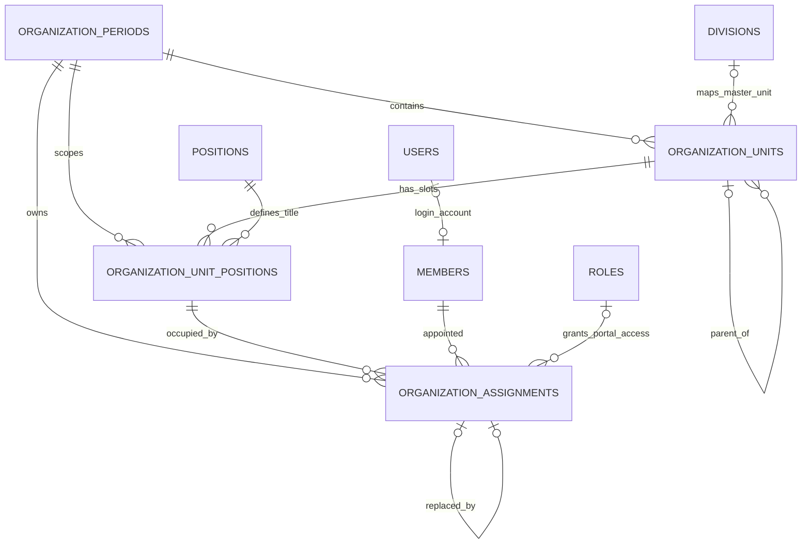
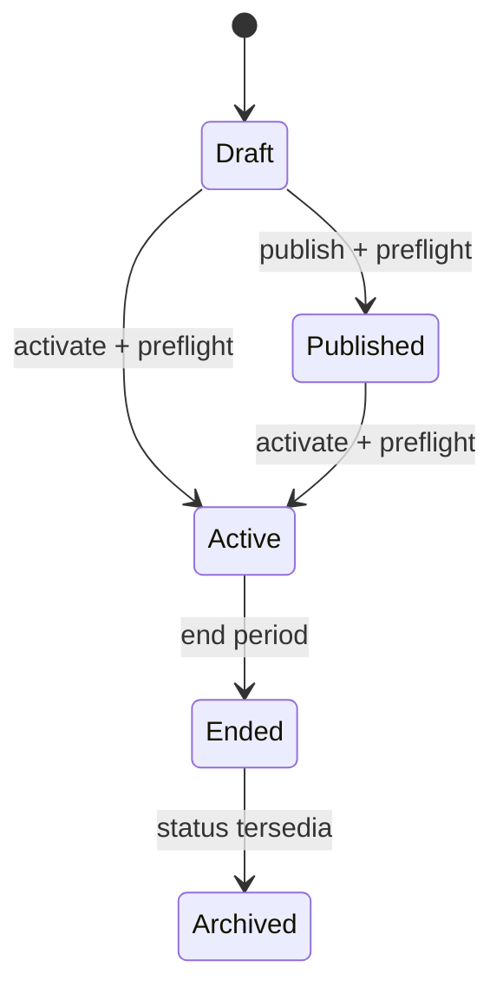

# Organization Management — Dashboard Sekretariat

## Tujuan modul

Modul Organization Management menjadi sumber data kepengurusan IDI per periode. Modul ini menggantikan struktur statis dengan struktur bertingkat yang dapat disusun ulang, menghubungkan member ke jabatan dan role portal, menjaga riwayat pergantian pengurus, serta menyediakan workflow periode dari draft sampai berakhir.

Halaman utama tersedia di `GET /secretariat/organization`. Data rinci dimuat melalui JSON API pada prefix `/organization` agar chart, kartu unit, tabel pengurus, pencarian member, dan riwayat dapat memuat ulang secara independen.

## Model data

### `organization_periods`

Mewakili satu masa kepengurusan.

| Kelompok | Field utama |
| --- | --- |
| Identitas | `id`, `name`, `notes` |
| Rentang | `start_date`, `end_date` |
| Workflow | `status`, `is_active`, `published_at`, `activated_at`, `ended_at` |
| Actor | `published_by`, `activated_by`, `ended_by`, `created_by`, `updated_by` |
| Lifecycle | `created_at`, `updated_at`, `deleted_at` |

Status yang tersedia adalah `draft`, `published`, `active`, `ended`, dan `archived`. Generated guard dengan unique index mencegah lebih dari satu periode berstatus aktif pada tingkat database.

### `organization_units`

Mewakili node dinamis pada struktur organisasi.

| Kelompok | Field utama |
| --- | --- |
| Scope | `period_id` |
| Hierarchy | `parent_id`, `display_order` |
| Master mapping | `master_unit_id` ke `divisions` |
| Identitas | `name`, `code`, `unit_type`, `description` |
| Flags | `is_core_structure`, `is_active` |
| Actor/lifecycle | `created_by`, `updated_by`, timestamps, soft delete |

Composite foreign key `(parent_id, period_id)` memastikan parent dan child selalu berada di periode yang sama. Circular reference juga ditolak oleh domain validator.

### `organization_unit_positions`

Mewakili slot jabatan dalam sebuah unit. Satu master `position` dapat dipakai oleh beberapa unit atau periode.

| Kelompok | Field utama |
| --- | --- |
| Scope | `period_id`, `organization_unit_id` |
| Jabatan | `position_id`, `custom_title` |
| Presentation | `display_order` |
| Rules | `is_required`, `is_active` |
| Lifecycle | timestamps, soft delete |

Composite foreign key memastikan slot selalu cocok dengan unit dan periodenya. `custom_title` mengubah label tampilan tanpa mengubah master jabatan.

### `organization_assignments`

Mewakili penempatan satu member ke satu slot jabatan dan role portal.

| Kelompok | Field utama |
| --- | --- |
| Scope | `period_id`, `organization_unit_id`, `unit_position_id` |
| Subject/access | `member_id`, `portal_role_id` |
| Date/status | `started_at`, `ended_at`, `status` |
| SK/catatan | `appointment_number`, `appointment_date`, `notes`, `end_reason` |
| History | `replaced_by_assignment_id` |
| Access provenance | `role_was_preexisting`, `account_was_active`, `account_was_created`, `access_applied_at`, `access_revoked_at` |
| Actor/lifecycle | `created_by`, `updated_by`, `ended_by`, timestamps, soft delete |

Status assignment adalah `draft`, `active`, `replaced`, `ended`, dan `cancelled`. Generated `current_guard` menganggap `draft` dan `active` sebagai assignment berjalan. Unique index database menjamin:

- satu member hanya memiliki satu assignment berjalan dalam satu periode;
- satu slot hanya ditempati satu assignment berjalan dalam satu periode;
- assignment historis tetap dapat berulang tanpa merusak constraint.

### Perubahan master terkait

Master `positions` ditambah `description`, `level`, `display_order`, dan `is_leadership`. Relasi aktif `members.user_id` juga dilindungi generated unique guard sehingga satu user tidak dapat terhubung ke lebih dari satu member aktif, tetapi link dapat digunakan kembali setelah member di-soft-delete.

## Diagram relasi

`Position` menentukan jabatan organisasi, sedangkan `Role` menentukan otorisasi portal. Keduanya sengaja dipisahkan: jabatan yang sama dapat diberi role portal yang berbeda sesuai kebutuhan operasional.

## Workflow periode

### Membuat atau menyalin draft

Periode baru selalu dibuat sebagai `draft`. Struktur dapat dibuat kosong atau disalin dari periode sumber. Clone menyalin hierarchy unit dan slot jabatan dalam satu transaksi, tetapi tidak menyalin assignment pengurus.

### Preflight, publish, dan activate

Preflight memeriksa metadata tanggal, ketersediaan struktur aktif, parent hierarchy, slot wajib kosong, validitas member, master jabatan, role portal, serta konflik member/slot. UI menampilkan semua issue sebelum konfirmasi.

`publish` hanya menerima periode draft. `activate` menerima draft atau published, memastikan belum ada periode aktif lain, kemudian mengaktifkan seluruh assignment draft. Perubahan status periode, assignment, user, role, dan placement member berada dalam boundary transaksi yang sama.

### Mengakhiri periode

Dialog akhir periode menampilkan dampak assignment, role, division/position, dan kandidat periode pengganti. Setelah dikonfirmasi:

1. seluruh assignment berjalan diakhiri;
2. akses yang dikelola assignment dicabut;
3. member dikembalikan ke status/role `anggota` dan placement organisasi dikosongkan;
4. sesi dan personal access token user dibatalkan;
5. periode menjadi `ended` dan read-only;
6. riwayat struktur dan assignment tetap dapat dibaca.

## Workflow assignment dan akses user

### Assignment pada draft/published

Assignment dibuat dengan status `draft`. Tidak ada akun, role, atau placement member yang diubah sampai periode diaktifkan.

### Assignment pada periode aktif

Assignment langsung menjadi `active` dan proses berikut dijalankan atomik:

1. lock periode, unit, slot, member, dan role;
2. validasi periode, hubungan unit-slot, status member, role, tanggal, dan konflik;
3. gunakan akun yang sudah tertaut, tautkan akun dengan email yang sama, atau buat akun baru;
4. kirim reset-password link untuk akun baru hanya setelah commit;
5. tambahkan role portal yang dipilih dan hapus role `anggota` selama menjabat;
6. sinkronkan `members.division_id` dan `members.position_id`;
7. simpan provenance agar pencabutan akses tidak menghapus role atau status akun yang sudah dimiliki sebelumnya.

Role selain role yang dikelola assignment tidak ditimpa. Role `superadmin` hanya boleh diberikan oleh actor yang juga memiliki role `superadmin`.

### Replace dan end assignment

Replace mengakhiri assignment lama sebagai `replaced`, mencabut akses lama, membuat assignment pengganti, lalu menyimpan `replaced_by_assignment_id`. Jika satu tahap gagal, semua perubahan di-rollback.

End mengubah assignment berjalan menjadi `ended`, menyimpan tanggal/alasan/actor, mencabut managed role bila role tersebut bukan milik user sebelumnya, menambahkan role `anggota`, mengembalikan status aktif akun sesuai provenance, mengosongkan placement member, dan membatalkan sesi/token.

## Permission dan role

| Permission | Fungsi |
| --- | --- |
| `organization.view` | Melihat periode berjalan, chart, unit, dan pengurus |
| `organization.history.view` | Melihat periode ended/archived dan riwayat member |
| `organization.period.create` | Membuat periode draft |
| `organization.period.update` | Mengubah metadata draft/published |
| `organization.period.publish` | Publish draft |
| `organization.period.activate` | Mengaktifkan draft/published |
| `organization.period.end` | Mengakhiri periode aktif |
| `organization.structure.manage` | Membuat, mengubah, memindah, dan menonaktifkan unit/slot |
| `organization.assignment.manage` | Membuat, mengubah, dan mengakhiri assignment |
| `organization.assignment.replace` | Mengganti assignment aktif |

Mapping default role:

| Role | Akses organisasi |
| --- | --- |
| `superadmin`, `admin` | Semua permission organisasi |
| `sekretaris`, `ketua` | Semua permission organisasi |
| `bendahara` | View dan history |
| `anggota` | Tidak mendapat permission organisasi secara default |

Backend tetap menjadi sumber kebenaran. Tombol frontend mengikuti shared permission, tetapi setiap endpoint mutasi diperiksa ulang melalui middleware, policy, dan `FormRequest::authorize()`.

## Endpoint

Semua endpoint berikut memakai session web, CSRF Laravel untuk mutasi, middleware `auth`, `verified`, dan permission organisasi. Query list divalidasi dan `per_page` dibatasi maksimal 50 atau 100.

### Halaman dan periode

| Method | URI | Kegunaan |
| --- | --- | --- |
| `GET` | `/secretariat/organization` | Shell dashboard Inertia |
| `GET` | `/organization/periods` | Daftar periode paginated |
| `POST` | `/organization/periods` | Buat draft, opsional clone sumber |
| `GET` | `/organization/periods/{period}` | Detail periode |
| `PATCH` | `/organization/periods/{period}` | Ubah metadata periode |
| `POST` | `/organization/periods/{period}/clone-structure` | Clone struktur ke draft kosong |
| `GET` | `/organization/periods/{period}/workflow-summary?action=...` | Preflight publish/activate/end |
| `POST` | `/organization/periods/{period}/publish` | Publish periode |
| `POST` | `/organization/periods/{period}/activate` | Aktifkan periode |
| `POST` | `/organization/periods/{period}/end` | Akhiri periode |
| `GET` | `/organization/periods/{period}/chart` | Tree chart lengkap |

### Unit dan slot jabatan

| Method | URI | Kegunaan |
| --- | --- | --- |
| `GET` | `/organization/periods/{period}/units` | List/filter/sort/paginate unit |
| `POST` | `/organization/periods/{period}/units` | Tambah unit |
| `GET` | `/organization/units/{unit}` | Detail unit |
| `PATCH` | `/organization/units/{unit}` | Ubah unit |
| `POST` | `/organization/units/{unit}/move` | Pindah parent/order |
| `POST` | `/organization/units/{unit}/deactivate` | Nonaktifkan unit aman |
| `GET` | `/organization/units/{unit}/positions` | List slot jabatan |
| `POST` | `/organization/units/{unit}/positions` | Tambah slot |
| `PATCH` | `/organization/unit-positions/{slot}` | Ubah slot |
| `POST` | `/organization/unit-positions/{slot}/deactivate` | Nonaktifkan slot aman |

### Assignment dan member

| Method | URI | Kegunaan |
| --- | --- | --- |
| `GET` | `/organization/periods/{period}/assignments` | List/filter/sort/paginate pengurus |
| `POST` | `/organization/assignments` | Tambah assignment |
| `GET` | `/organization/assignments/{assignment}` | Detail assignment |
| `PATCH` | `/organization/assignments/{assignment}` | Ubah metadata assignment |
| `POST` | `/organization/assignments/{assignment}/replace` | Ganti pengurus |
| `POST` | `/organization/assignments/{assignment}/end` | Akhiri assignment |
| `GET` | `/organization/members/search` | Pencarian member minimal/paginated |
| `GET` | `/organization/members/{member}/eligibility` | Validasi kelayakan member |
| `GET` | `/organization/members/{member}/history` | Riwayat assignment member |

Domain violation dikembalikan sebagai HTTP 422 dengan error field-level. Otorisasi menghasilkan 403, input tidak valid 422, dan model yang tidak ditemukan 404.

## Audit event

Semua event menggunakan log name `organization`. Properties standar memuat `actor_user_id`, `actor_member_id`, tipe/id entity, old/new values, alasan, IP address, dan user agent.

| Area | Events |
| --- | --- |
| Periode | `organization.period.created`, `.updated`, `.published`, `.activated`, `.ended` |
| Struktur | `organization.structure.cloned`, `organization.unit.created`, `.updated`, `.moved`, `.deactivated`, `organization.position.created`, `.updated` |
| Assignment | `organization.assignment.created`, `.updated`, `.activated`, `.replaced`, `.ended` |
| Akun/akses | `organization.account.created`, `.linked`, `organization.role.assigned`, `.revoked`, `organization.member.returned_to_member` |

Password, reset token, session payload, dan personal access token tidak dimasukkan ke audit properties atau API resource.

## Transaction dan concurrency control

- Create/update/publish/activate/end periode memakai transaksi; operasi status menggunakan `lockForUpdate()`.
- Clone structure mengunci source, target, unit, dan slot dalam urutan deterministik.
- Create/update/activate/replace/end assignment mengunci context dan row assignment.
- Conflict diperiksa oleh service dan diperkuat unique generated guards untuk periode aktif, member berjalan, dan slot berjalan.
- Database composite foreign key mencegah hierarchy atau assignment lintas periode/unit.
- Provisioning akun, perubahan role, placement member, assignment, dan audit masuk dalam transaksi yang sama.
- Email reset password dijadwalkan melalui `DB::afterCommit()` agar tidak terkirim jika transaksi gagal.
- Double submit tidak membuat assignment kedua; unique violation diterjemahkan menjadi pesan domain yang aman.

## Security review

- Semua route organisasi mensyaratkan autentikasi, email terverifikasi, permission middleware, dan policy/FormRequest pada object terkait.
- Parameter action workflow memakai allow-list `publish,activate,end`; parameter filter/sort/status juga memakai allow-list.
- Search menggunakan parameter binding Eloquent, panjang input maksimal 100 karakter, minimal dua karakter untuk member search, dan pagination maksimal 50.
- JSON resource hanya mengekspos data profil yang dibutuhkan UI; credential dan token tidak pernah diekspos.
- React merender nilai sebagai text dan modul organisasi tidak memakai `dangerouslySetInnerHTML`.
- CSRF mengikuti middleware web Laravel. Rate limiting mengikuti konfigurasi route web aplikasi; endpoint pencarian juga dibatasi oleh debounce UI, minimal query, dan pagination.
- Non-superadmin tidak dapat memberikan role `superadmin` walaupun dapat mengelola assignment.
- Pencabutan akses merotasi remember token serta menghapus database session dan personal access token.
- Periode ended/archived read-only di policy dan domain service, bukan hanya di UI.

## Performance

- Daftar periode, unit, assignment, member search, dan history memakai server-side pagination.
- Filter dan sort dikerjakan di database; field yang sering dipakai memiliki index periode/status/unit/member/tanggal.
- Chart mengambil semua unit karena membutuhkan satu tree konsisten, tetapi relations di-eager-load dan tree dirakit in-memory tanpa recursive query.
- Preflight mengambil hierarchy sekali dan memvalidasi melalui map in-memory. Test regresi memastikan jumlah query tetap maksimal 15 pada tree 26 unit.
- Validator memakai relation `position` dan `memberStatus` yang sudah di-eager-load sehingga tidak menimbulkan N+1 per assignment.
- Chart, kartu unit, tabel member, history, dan dialog workflow merupakan lazy chunks terpisah. Panel hanya diunduh ketika tab atau dialog digunakan.
- UI menyediakan debounce search, loading skeleton, empty/error state, dan tidak melakukan request detail assignment pada initial page load.

## Testing

Suite organisasi berada di `tests/Feature/Organization` dan mencakup:

- schema, relation, generated unique guard, composite foreign key, soft delete;
- permission seeder, authentication, policy, forbidden mutation, dan proteksi role superadmin;
- create/update/clone period dan structure, cycle/cross-period rejection, safe deactivate;
- chart/resource contract, unit filters, member table filters, sorting, pagination;
- account reuse/create/reactivate, role synchronization, placement member, session invalidation;
- duplicate member/slot, inactive member, rollback replace, history preservation;
- publish/activate/end preflight, actor metadata, read-only ended period;
- query-budget regression untuk preflight hierarchy.

Per verifikasi Step 11: 49 test organisasi lulus dengan 468 assertions; full suite lulus 217 test dengan 1.263 assertions. Migration juga berhasil dijalankan dari database SQLite kosong, rollback dan migrate ulang berhasil, serta seluruh file PHP organisasi lulus Pint scoped.

## Batasan dan risiko tersisa

- Status `archived` sudah dimodelkan dan diperlakukan read-only, tetapi belum memiliki transition/API/UI khusus.
- Pengiriman reset-password link bergantung pada konfigurasi mail dan worker/transport environment.
- Chart sengaja tidak dipaginasi; organisasi dengan ribuan node mungkin memerlukan virtualized tree atau endpoint per cabang.
- Repository belum memiliki skrip ESLint maupun typecheck JavaScript/TypeScript. Build Vite menjadi pemeriksaan sintaks frontend yang tersedia.
- Pint global masih melaporkan debt style pada modul lama di luar Organization Management.
- Bundle aplikasi global masih melewati warning 500 kB dan data Browserslist perlu diperbarui; panel organisasi sendiri sudah dipecah menjadi lazy chunks.

## Keputusan teknis

1. Struktur menggunakan adjacency list (`parent_id`) karena mendukung edit dan clone sederhana serta cocok dengan ukuran organisasi saat ini.
2. Struktur dan assignment diduplikasi per periode agar riwayat tidak berubah ketika master division/position diperbarui.
3. Jabatan organisasi (`positions`) dan role portal (`roles`) dipisahkan agar struktur tidak terikat langsung pada matriks permission.
4. History disimpan sebagai row status, bukan overwrite atau hard delete.
5. Integrity penting ditegakkan ganda di domain service dan database agar tetap aman terhadap request paralel.
6. Provenance akses disimpan per assignment agar sistem hanya mencabut akses yang benar-benar dikelolanya.
7. Server authorization menjadi sumber kebenaran; frontend permission hanya mengendalikan affordance.
8. JSON API dipakai untuk panel interaktif, sedangkan Inertia menyediakan shell, periode terpilih, summary, dan action flags.
9. Operasi yang menyentuh periode, assignment, member, user, dan role memakai transaksi dan pessimistic locks.
10. Panel berat dilazy-load dan query list dipaginasi untuk menjaga initial load tetap ringan.
